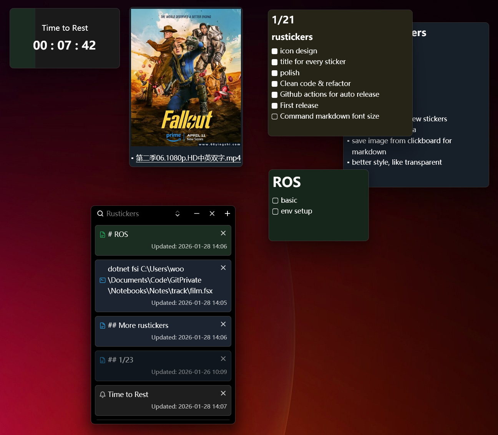

# Rustickers

A tiny desktop sticker app for quick notes, timers, and command outputs — built with [GPUI](https://github.com/zed-industries/zed/tree/main/crates/gpui) and backed by a local SQLite database.

- **Single instance**: launching again focuses the existing app
- **Global hotkey**: show the main window anytime.
- **Persistent**: sticker windows restore on restart (position/size/state)



## What you can do

### Sticker types

| Type | What it’s for | Handy details |
| --- | --- | --- |
| **Text / Markdown** | Notes, checklists, snippets | Edit mode when empty; **Ctrl+S** saves; double‑click preview to edit |
| **Timer** | Reminders and quick countdowns | Sends a desktop notification when finished |
| **Command** | Pin the output of a command | Optional **cron** scheduling; supports env vars + working directory |

### Quality-of-life

- **Search & sort** in the main window (by created/updated time)
- **Color swatches** on sticker hover
- **Double‑click** a sticker card to open (or re-open) its window

## Hotkeys

- **Show main window**: `Ctrl + Alt + R`
  - On macOS: `Cmd + Alt + R` also works
- **Markdown sticker save**: `Ctrl + S` (while editing)

## Running

### From source (development)

Prerequisites:
- Rust (stable toolchain)

Build and run:

```bash
cargo run
```

### Build a release binary

```bash
cargo build --release
```

The executable will be in `target/release/` (Windows: `target\release\rustickers.exe`).

## Data storage

Rustickers stores everything in a local SQLite DB named `stickers.db` under your OS application data directory (via `directories::ProjectDirs`).

Typical locations:
- **Windows**: `%LOCALAPPDATA%\rustickers\data\stickers.db`
- **macOS**: `~/Library/Application Support/rustickers/data/stickers.db`
- **Linux**: `~/.local/share/rustickers/data/stickers.db`

## Logging

Rustickers writes logs to a daily-rotating file under the same app data directory as the database:

- **Windows**: `%LOCALAPPDATA%\rustickers\data\logs\`
- **macOS**: `~/Library/Application Support/rustickers/data/logs/`
- **Linux**: `~/.local/share/rustickers/data/logs/`

Log level can be configured with:

- `RUSTICKERS_LOG` (preferred), e.g. `RUSTICKERS_LOG=debug`
- `RUST_LOG` (fallback)

## Releases

This repo’s GitHub Actions workflow builds release artifacts when you push a tag like `v0.1.0`:

- **Windows**: a `.zip` with `rustickers.exe`
- **Linux**: (not working right now) a `.tar.gz` containing `rustickers`, `rustickers.desktop`, `rustickers.png`, and `install.sh`
- **macOS**: a `.zip` containing `Rustickers.app` (with a generated `.icns` app icon)
