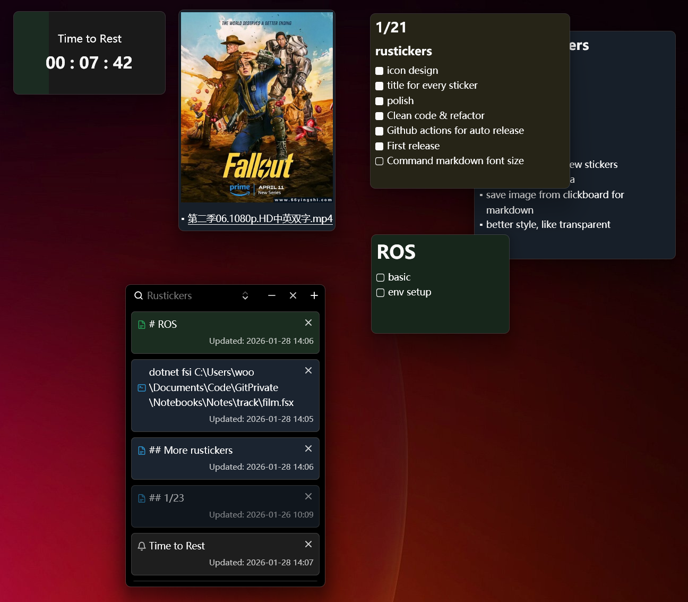

# Rustickers

A lightweight desktop sticker app for notes, timers, command output, and file previews.

Built with [GPUI](https://github.com/zed-industries/zed/tree/main/crates/gpui), powered by local SQLite, and designed to stay fast and simple.



## Highlights

- **Markdown notes**: quick editing, preview mode, and **Ctrl+S** save.
- **Timers**: countdown timers with an audible alert on completion.
- **Command stickers**: pin command output, with optional cron scheduling, env vars, and working directory.
- **File / URL preview**: preview files, folders, or URLs and pin them as stickers. Any number of previews can be open side by side; asking for the same files again raises the window that already shows them.
- **Paint stickers**: freehand drawing space for quick sketches.

## Global hotkeys

- **Show main window**: `Ctrl + Alt + R` (macOS also supports `Cmd + Alt + R`)
- **Toggle quick file preview**: `Ctrl/Cmd + Alt`
- **Open command for selected text**: `Ctrl/Cmd + Space` (consumed instead of forwarded to the active app)
- **Dismiss transient Rustickers windows**: `Esc` is consumed for selection popups, quick previews, and selected-text command runs
- **Save in editor/markdown views**: `Ctrl + S`

## Quick start

Prerequisite: stable Rust toolchain.

Run the desktop app:

```bash
cargo run
```

Run the CLI:

```bash
cargo run --bin rusticker --no-default-features --features cli -- --help
```

Build release binaries:

```bash
cargo build --release --bin rustickers
cargo build --release --bin rusticker --no-default-features --features cli
```

Outputs are written to `target/release/`.

## CLI commands

`rusticker` is the scripting surface for the app. It writes to the same database the app reads, so
changes apply immediately when the app is running and on next launch when it is not.

| Command | What it does |
| --- | --- |
| `list [--state open\|close\|all] [--type <t>] [-s <text>] [-n <limit>]` | Find stickers |
| `show <id> [--content-only]` | Everything stored about one sticker |
| `result <id>` | What a command sticker last produced |
| `open <id>` / `close <id>` | Show or hide a sticker's window |
| `delete <id> [-y]` | Remove a sticker permanently |
| `view <path-or-url>` | Preview a file, folder or URL |
| `markdown [-c <text>] [-f <file>]` | Create a note sticker |
| `cmd <command> [...]` | Create a command sticker |
| `skill [list\|show <name>\|run <name>]` | Worked examples |

All of them accept the shared appearance options `--width`, `--height`, `--left`, `--top`,
`--color` (yellow, green, blue, pink, gray), `--top-most` and `--closed`. Markdown and command
stickers default to 400×300; file and URL stickers are sized from their content.

Passing a single file path or URL is treated as `view <source>` automatically, and trailing
options are forwarded.

### Command stickers

`rusticker cmd` exposes everything a command sticker can do:

```bash
rusticker cmd "cargo test" --result text --dir .          # run and show plain output
rusticker cmd "npm test 2>&1 | tail -20" --shell          # use a shell for pipes and redirection
rusticker cmd "gh pr list" --cron "0 */5 * * * *"         # re-run every five minutes
rusticker cmd "copilot -p {{RUSTICKERS_SELECTION}}" \
  --accept-selection --result markdown --closed           # answer whatever text you have selected
```

Output can be rendered five ways with `--result`: `text`, `markdown`, `html` (an embedded browser
view), `svg` (an image) or `source` (the output is one file path or URL to preview). Other useful
flags are `--stream`, `--no-window`, `--auto-close`, `--padding`, `--env KEY=VALUE` and `--idle`.

Two things are worth knowing. A command sticker does **not** run through a shell by default: the
string is split with Windows argument rules and the program is looked up on `PATH`, so pipes and
`&&` are literal text until you add `--shell`. And a sticker created without `--idle` is *armed*,
meaning it runs when its window opens and again each time the app starts.

### Machine-readable output

Add `--json` to any command to get exactly one JSON object on stdout, with an `ok` field so
success and failure parse the same way:

```bash
rusticker cmd "git status --short" --dir . --json   # -> {"ok":true,"id":42,...}
rusticker result 42 --json                          # -> {"ok":true,"output":"...","has_run":true}
```

### Skills

`rusticker skill list` is a catalogue of ready-made stickers — selection-driven AI prompts,
scheduled watchers, HTML and SVG reports. `skill show <name>` explains one and prints the exact
`rusticker` command it is equivalent to, and `skill run <name> --var key=value` creates it.
`--dry-run` prints the command without creating anything.

## Data and logs

Rustickers stores data in `stickers.db` under your app data directory and writes daily-rotated logs to a sibling `logs/` directory.

Typical locations:

- **Windows**: `%LOCALAPPDATA%\rustickers\data\stickers.db` and `%LOCALAPPDATA%\rustickers\data\logs\`
- **macOS**: `~/Library/Application Support/rustickers/data/stickers.db` and `~/Library/Application Support/rustickers/data/logs/`
- **Linux**: `~/.local/share/rustickers/data/stickers.db` and `~/.local/share/rustickers/data/logs/`

Log level precedence:

1. `RUSTICKERS_LOG`
2. `RUST_LOG`
3. fallback: `trace` (debug) / `info` (release)

## Releases

Tagging (for example `v0.1.0`) triggers GitHub Actions release artifacts for Windows and macOS (UI + CLI bundles).
